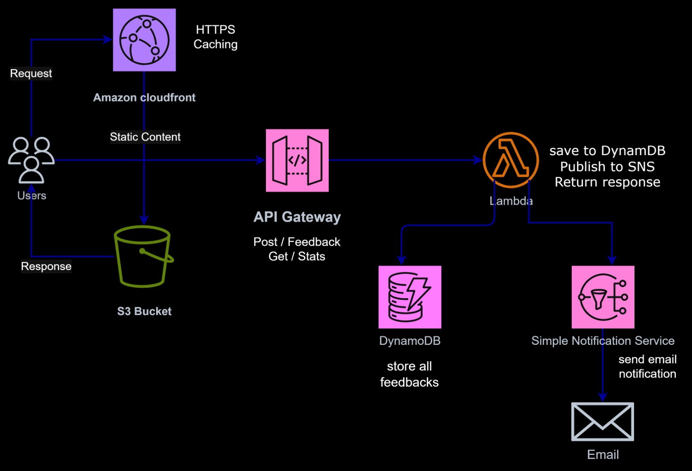
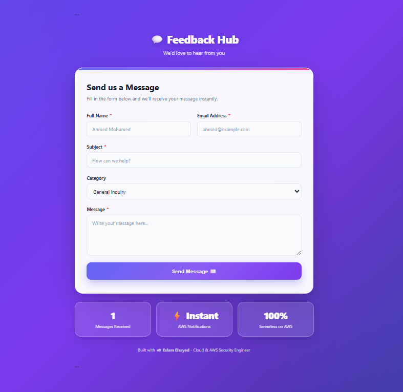

# 💬 AWS Serverless Feedback & Contact Form


## 📌 Overview

**AWS Serverless Feedback & Contact Form** is a cloud-native, fully serverless web application built on AWS.

Users can submit feedback or contact messages through a responsive web interface. The backend processes requests using AWS Lambda, stores messages in Amazon DynamoDB, and sends email notifications through Amazon SNS.

The frontend is hosted on Amazon S3 and delivered through Amazon CloudFront using HTTPS.

No EC2 instances or traditional servers are required.

---

## ✨ Features

- ✅ Responsive contact and feedback form
- ✅ Client-side and server-side validation
- ✅ Serverless REST API
- ✅ Message storage in DynamoDB
- ✅ Email notifications using SNS
- ✅ Total message counter
- ✅ HTTPS delivery through CloudFront
- ✅ Fully serverless architecture
- ✅ AWS Free Tier friendly

---

## 🏗️ Architecture



---

## ☁️ AWS Services

| Service | Purpose |
|---|---|
| **Amazon S3** | Static frontend hosting |
| **Amazon CloudFront** | CDN and HTTPS delivery |
| **Amazon API Gateway** | REST API endpoints |
| **AWS Lambda** | Backend business logic |
| **Amazon DynamoDB** | Message storage |
| **Amazon SNS** | Email notifications |
| **AWS IAM** | Access control and permissions |

---

## 📁 Project Structure

```text
feedback-project/
│
├── frontend/
│   ├── index.html
│   ├── style.css
│   └── script.js
│
├── lambda/
│   └── lambda_function.py
│
├── images/
│   └── feedback-hub.png
│
├── docs/
│   └── deployment-guide.md
│
└── README.md
```

## 📸 Final Result

### Screenshots

| Form Submission | DynamoDB Record | Email Notification |
|-----------------|-----------------|-------------------|
|  |  |  |

---


## 🔄 How It Works

### Submit Feedback

```text
User
  ↓
CloudFront
  ↓
S3 Frontend
  ↓
API Gateway
  ↓
Lambda
  ├──→ DynamoDB
  └──→ SNS → Email
```

### Get Submission Statistics

```text
Frontend
   ↓
API Gateway
   ↓
Lambda
   ↓
DynamoDB
   ↓
Total Messages
```

---

## 🔌 API Endpoints

| Method | Endpoint | Description |
|---|---|---|
| `POST` | `/feedback` | Submit a feedback/contact message |
| `GET` | `/stats` | Retrieve total message count |

---

## 🧪 Testing

The application was tested across the complete serverless flow:

- Form validation
- API Gateway requests
- Lambda processing
- DynamoDB message storage
- SNS email notifications
- Message counter
- CloudFront HTTPS access

Expected flow:

```text
Form Submission
      ↓
API Gateway
      ↓
Lambda
   ↙     ↘
DynamoDB  SNS
             ↓
           Email
```

---

## 🔐 Security & IAM

The Lambda function uses a dedicated IAM execution role with permissions required for:

- CloudWatch Logs
- DynamoDB `PutItem`
- DynamoDB `Scan`
- SNS `Publish`

The architecture separates the frontend, API, compute, storage, and notification layers.

---

## 📚 Documentation

For the complete AWS Console deployment instructions, see:

👉 [Deployment Guide](docs/deployment-guide.md)

---

## 💡 What I Learned

Through this project, I practiced:

- AWS Serverless Architecture
- Amazon S3
- Amazon CloudFront
- API Gateway REST APIs
- AWS Lambda with Python
- DynamoDB
- SNS
- IAM roles and permissions
- CORS configuration
- API integration
- End-to-end cloud deployment

---

## 🔮 Future Improvements

- 🔐 Add Amazon Cognito for admin authentication
- 📧 Use Amazon SES for user replies
- 📊 Add CloudWatch dashboards and analytics
- 🛡️ Add API Gateway throttling/rate limiting
- 📎 Support file attachments using S3
- 🤖 Add Amazon Comprehend for message/spam analysis

---

### Focus Areas

- ☁️ AWS Cloud
- 🔐 Cloud Security
- ⚙️ DevOps
- 🌐 Networking
- 🏗️ Cloud Infrastructure

---

⭐ If you found this project useful, feel free to star the repository!
